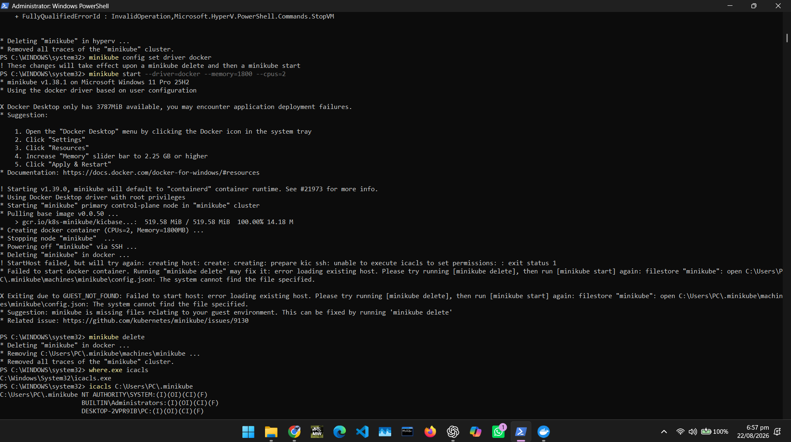
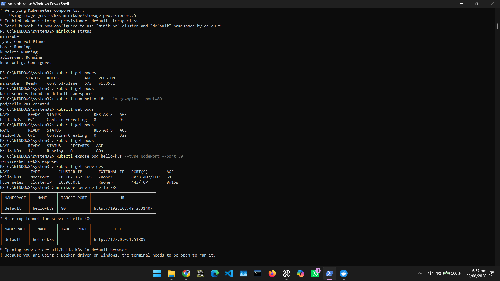

# Kubernetes Exercise

A hands-on Kubernetes exercise using **Minikube** on a local machine, covering installation, configuration and running pods with an Nginx deployment.

## Steps Covered

### 1. Installing Chocolatey
Chocolatey is used as the Windows package manager to install Minikube and kubectl.

### 2. Install Check
Verifying that all required tools (kubectl, Minikube) are correctly installed.

### 3. Starting Minikube
Initialising a local Kubernetes cluster using `minikube start`.

### 4. Configuration
Checking the cluster configuration and context with `kubectl config view`.

### 5. Running Pods
Deploying and listing running pods inside the cluster.

### 6. Nginx on Desktop
Accessing the Nginx service through the Minikube tunnel in the browser.

## Tools Used
- [Minikube](https://minikube.sigs.k8s.io/) — local Kubernetes cluster
- [kubectl](https://kubernetes.io/docs/reference/kubectl/) — Kubernetes CLI
- [Chocolatey](https://chocolatey.org/) — Windows package manager
- Nginx — sample deployment to verify the cluster is working
